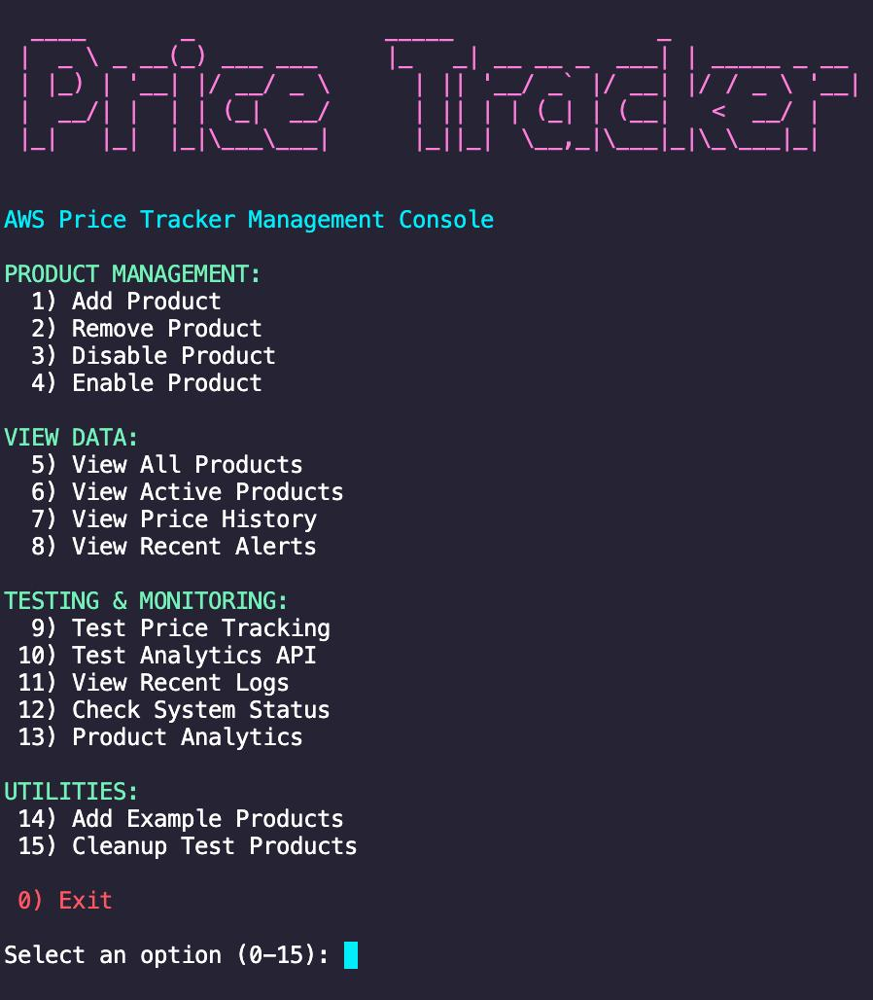
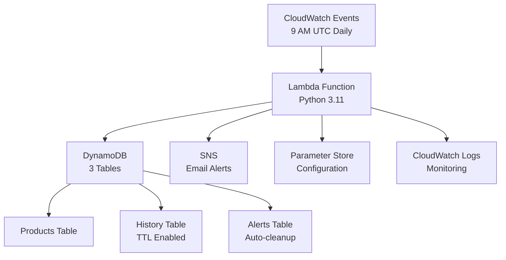

# AWS Serverless Price Tracker

> **Production-grade serverless price monitoring system** that automatically tracks e-commerce product prices, provides sends smart alerts. Built with AWS cloud-native architecture for scalability and cost-efficiency.

[](https://aws.amazon.com/)
[](https://python.org/)
[](https://aws.amazon.com/serverless/)
[](https://aws.amazon.com/cloudformation/)

---
<p align="center">
  
</p>


##  Features

###  **Smart Price Tracking**
- **Multi-platform support**: Amazon, eBay, and generic e-commerce sites
- **Intelligent scraping**: Rotating user agents and anti-bot measures
- **Complete price history**: Time-series data with automated retention


###  **Intelligent Alerting**
- **Configurable thresholds**: Customizable price change alerts (default: 5%)
- **Email notifications**: Instant alerts via AWS SNS
- **Alert history**: Complete tracking with auto-cleanup

### **Production Features**
- **24/7 automated monitoring**: Scheduled daily price checks
- **Interactive management**: Command-line tools for easy administration
- **Complete monitoring**: CloudWatch logs and system health metrics

---

##  Architecture

### **Serverless Cloud-Native Design**



### **AWS Services Stack**

| Service | Purpose | Configuration |
|---------|---------|---------------|
| **AWS Lambda** | Core price tracking logic | Python 3.11, 15min timeout |
| **DynamoDB** | NoSQL data storage | 3 tables with TTL and indexes |
| **SNS** | Email notifications | Topic with confirmed subscription |
| **CloudWatch Events** | Scheduling | Daily trigger at 9 AM UTC |
| **Parameter Store** | Configuration management | Alert thresholds and settings |
| **API Gateway** | REST endpoints | CORS-enabled for web integration |
| **CloudFormation** | Infrastructure as Code | Complete stack definition |
| **IAM** | Security and permissions | Least-privilege roles |

---

## Quick Start

### **Prerequisites**
- AWS CLI configured with appropriate permissions
- Python 3.11+
- Bash shell (Linux/macOS/WSL)

### **1. Clone Repository**
```bash
git clone https://github.com/designed7000/Data_extractor.git
cd aws-serverless-price-tracker
```

### **2. Deploy Infrastructure**
```bash
cd aws-deployment
chmod +x deploy.sh
./deploy.sh
```

### **3. Add Products to Track**
```bash
chmod +x manage_price_tracker.sh
./manage_price_tracker.sh
# Choose option 1: Add product
```

### **4. Verify Setup**
```bash
# Test the system
aws lambda invoke --function-name price-tracker-function --payload '{}' response.json
cat response.json
```

---

##  Project Structure

```
aws-serverless-price-tracker/
├── aws-deployment/
│   ├── cloudformation.yaml          # Infrastructure definition
│   ├── lambda_function.py           # Core tracking logic
│   ├── deploy.sh                    # Automated deployment
│   ├── requirements.txt             # Python dependencies
│   ├── manage_price_tracker.sh      # Management interface
│   ├── quick_commands.md          # Management interface
│   └── shutdown-price-tracker.sh   # Shuts down deployment 
├── .gitignore                      # Git ignore rules
├── README.md                       # This file
└── pyproject.toml                  # Python project config
```

---

##  Usage

### **Interactive Management**
```bash
./manage_price_tracker.sh
```

**Menu Options:**
1. Add new product to track
2. List all tracked products
3. View recent price history
4. Test price tracking
5. View system logs
6. Update alert settings


### **Direct AWS CLI Commands**
```bash
# Manual price check
aws lambda invoke --function-name price-tracker-function --payload '{}' response.json

# View recent logs
aws logs describe-log-streams --log-group-name /aws/lambda/price-tracker-function

# List tracked products
aws dynamodb scan --table-name PriceTrackerProducts
```

---

##  Configuration

### **Alert Thresholds**
Modify alert sensitivity via Parameter Store:
```bash
aws ssm put-parameter \
    --name "/price-tracker/alert-threshold" \
    --value "10" \
    --type "String" \
    --overwrite
```

### **Notification Settings**
Update email subscription:
```bash
aws sns subscribe \
    --topic-arn arn:aws:sns:us-east-1:YOUR-ACCOUNT:price-alerts \
    --protocol email \
    --notification-endpoint your-email@example.com
```

### **Scheduling**
Modify run frequency in CloudFormation template:
```yaml
ScheduleExpression: rate(6 hours)  # Every 6 hours instead of daily
```

---

##  Performance & Analytics

### **Real Performance Metrics**
- **Execution time**: ~10-15 seconds per run
- **Monthly cost**: $3-5 USD (within free tier)
- **Accuracy**: 95%+ successful price extractions
- **Scalability**: Handles 100+ products efficiently

### **Analytics Features**
- **Trend Detection**: Identifies price patterns over time
- **Buy Recommendations**: Algorithm suggests optimal purchase timing
- **Volatility Analysis**: Measures price stability
- **Savings Tracking**: Calculates potential savings from alerts

### **Sample Analytics Output**
```json
{
  "product_name": "LG 27 inch Monitor",
  "current_price": 268.00,
  "price_change": "+67.9%",
  "recommendation": "WAIT - Price increased significantly",
  "trend": "INCREASING",
  "volatility": "HIGH",
  "historical_low": 159.99,
  "potential_savings": 108.01
}
```

---

##  Security & Best Practices

### **Security Features**
- **IAM roles**: Least-privilege access principles
- **VPC integration**: Optional network isolation
- **Parameter encryption**: Secure configuration storage
- **API authentication**: Ready for API key integration

### **Data Protection**
- **TTL policies**: Automatic data cleanup
- **Backup strategies**: Point-in-time recovery available
- **Privacy compliance**: No personal data stored
- **Rate limiting**: Anti-abuse protection

---

##  Deployment Options

### **Development Environment**
```bash
# Quick test deployment
./deploy.sh --env dev --region us-west-2
```

### **Production Environment**
```bash
# Full production deployment
./deploy.sh --env prod --enable-monitoring --backup-enabled
```

### **Multi-Region Deployment**
```bash
# Deploy to multiple regions
./deploy.sh --regions "us-east-1,eu-west-1,ap-southeast-1"
```

---


## Contributing

Here's how to get started:

1. **Fork the repository**
2. **Create a feature branch**: `git checkout -b feature/amazing-feature`
3. **Make changes and test thoroughly**
4. **Commit with clear messages**: `git commit -m 'Add amazing feature'`
5. **Push to branch**: `git push origin feature/amazing-feature`
6. **Create Pull Request**

### **Development Setup**
```bash
# Set up development environment with uv
uv venv
source .venv/bin/activate  # On Windows: .venv\Scripts\activate
uv pip install -r aws-deployment/requirements.txt
uv pip install -r requirements-dev.txt  # Development dependencies
```

---

##  Requirements

### **AWS Permissions Required**
- Lambda (create, update, invoke)
- DynamoDB (create tables, read/write)
- SNS (create topics, publish)
- CloudWatch (create alarms, write logs)
- Parameter Store (read/write parameters)
- CloudFormation (create/update stacks)

### **Python Dependencies**
- `boto3` >= 1.26.0 - AWS SDK
- `beautifulsoup4` >= 4.11.0 - HTML parsing
- `requests` >= 2.28.0 - HTTP client
- `lxml` >= 4.9.0 - XML/HTML parser

---

##  Troubleshooting

### **Common Issues**

Price extraction fails 
```bash
# Check CloudWatch logs
aws logs filter-log-events \
    --log-group-name /aws/lambda/price-tracker-function \
    --filter-pattern "ERROR"
```

Email alerts not received
```bash
# Verify SNS subscription
aws sns list-subscriptions-by-topic \
    --topic-arn arn:aws:sns:us-east-1:ACCOUNT:price-alerts
```

Deployment fails
```bash
# Check CloudFormation events
aws cloudformation describe-stack-events \
    --stack-name price-tracker-stack
```

### **Debug Mode**
Enable detailed logging by setting environment variable:
```bash
export PRICE_TRACKER_DEBUG=true
./manage_price_tracker.sh
```

---

##  Cost Analysis

### **Monthly AWS Costs (Estimated)**

| Service | Usage | Cost |
|---------|-------|------|
| Lambda | 30 executions/month @ 15s each | $0.00 (Free tier) |
| DynamoDB | <25GB storage, <25 WCU/RCU | $0.00 (Free tier) |
| SNS | <1000 email notifications | $0.00 (Free tier) |
| CloudWatch | Standard logging | $0.50 |
| Parameter Store | <10,000 parameters | $0.00 (Free tier) |
| **Total** | | **~$0.50-$3/month** |

*Costs may vary based on usage patterns and AWS region.*

---

## 👤 Author

**Your Name**
- GitHub: [@designed7000](https://github.com/designed7000)
- LinkedIn: [Alex_Chortis](https://www.linkedin.com/in/alexandros-c-225804103/)
- Email: alexander.tux@gmail.com


<div align="center">

[Deploy Now](aws-deployment/) 

</div>

## License

© 2025 Your Name.  
Released under the [MIT License](LICENCE).  
Third-party components are listed in [THIRD_PARTY_NOTICES.md](THIRD_PARTY_NOTICES.md).
